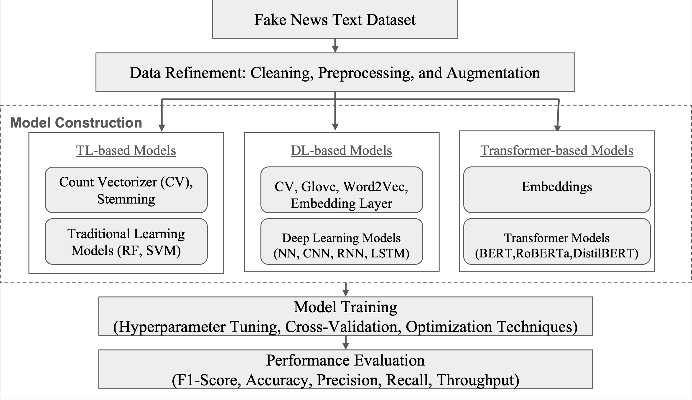

# RAFDA 2025: Evaluating the Impact of LLM-Manipulated Content on Fake News Detection

## Paper Overview

This study systematically evaluates the robustness of fake news detection methods — spanning traditional machine learning, deep learning-based models and transformer-based models, against LLM-generated texts using the WELFake dataset. 

### Objectives:
- Propose an integrated framework that combines content-based semantic analysis with source reliability metrics to enhance fake news detection.

- Conduct a comprehensive evaluation of traditional machine learning, deep learning, and transformer-based models, highlighting their strengths and limitations, particularly in detecting LLM-manipulated content.

- Investigate model generalizability by training on both original and LLM-rewritten datasets, addressing the challenge of detecting manipulated narratives in real-world scenarios.

---

### Overview of Models:



## Table of Contents

1. [Project Setup](#project-setup)
2. [Installation](#installation)
3. [Dataset](#dataset)
4. [Description of Notebooks](#description-of-notebooks)
5. [Contributors](#contributors)

---

## Project Setup

Before running the project, ensure you have the required libraries installed. The project is based on Python and utilizes several NLP and machine learning libraries.

---

## Installation

To set up the environment, follow these steps:

1.  Clone the repository:

        git clone https://github.com/inflaton/fake-news.git


2.  Create and setup the virtual environment:

        python -m venv venv

    source venv/bin/activate # For Linux/macOS
    venv\Scripts\activate # For Windows

4.  Install the required dependencies:
        
```
# Install deps
pip install -r requirements.txt

# To use CUDA, run following commands
# Install tensorflow with CUDA
pip install tensorflow[and-cuda]

``` 

The requirements.txt file includes the following packages:

- pandas==2.2.3
- numpy==1.26.4
- scipy==1.13.1
- tqdm==4.67.1
- matplotlib==3.10.0
- seaborn==0.13.2
- langdetect==1.0.9
- langid==1.1.6
- nltk==3.9.1
- spacy==3.8.4
- wordcloud==1.9.4
- scikit-learn==1.6.1
- tensorflow==2.18.0  # for windows users, you will need to specify tensorflow[and-cuda]
- torch==2.6.0
- transformers==4.48.3
- tokenizers==0.21.0
- keras==3.8.0
- gensim==4.3.3
- python-dotenv==1.0.1
- openai==1.60.1
- datasets==3.2.0
- ipywidgets==8.1.5
- evaluate==0.4.3
- tf-keras==2.18.0
- accelerate==1.4.0
- wandb==0.19.7

---

## Datasets

This project uses a labelled dataset of real and fake news articles, which is from the WELFake dataset downloaded from Kaggle. This dataset provides the foundational data for the rewriting of articles using LLMs, as well as training and evaluating the models.

- **Dataset link:** [Kaggle: WELFake Fake News Classification Dataset](https://www.kaggle.com/datasets/saurabhshahane/fake-news-classification)

Brief Description of dataset containing csv files:

- `train_data.csv` refers to the original training data from the WELFake dataset, separated into 4 files, which are loaded together for training. 
- `rewritten_train_data.csv` refers to the new training dataset generated from using Qwen2.5-7B to rewrite the original training dataset. 
- `test_data.csv` refers to the test data from the WELFake dataset.
- `rewritten_test_data.csv` Similarly, this dataset is generated from using Qwen2.5-7B to rewrite the original test dataset.
---
## Description of notebooks

### llm_experiments <br>
│ ├── `model.ipynb` For each model, there is a notebook which contains the pipeline for data preprocessing, training and evaluation. <br> 
│ ├── `model_results.ipynb` Similarly, each model has a corresponding notebook used to generate the results for the model's performance on each dataset.<br> 
│ ├── `utils.py` This script is used in model_results to replicate the result generation process for each model. 
### llm_toolkit <br>
| |── `eval_openai.py` Script for using Qwen2.5-7B to rewrite the news entries. <br>
| |── `llm_utils.py`  <br>
### model_experiments <br>
| |── Initial experiments for models, can ignore. <br> 
### processing_experiments <br>
│ ├── `booster_words.ipynb` Booster words with CountVectorizer to baseline models. <br>
│ ├── `count_vectoriser.ipynb` CountVectorizer to baseline models<br>
│ ├── `lemmatisation.ipynb` Lemmatisation to baseline models<br>
│ ├── `stemming.ipynb` Porter Stemmer to baseline models<br>
---

## Contributors

This project was developed by:

- Huang Donghao
  [ORCID] (0009−0005−6767−4872)
- Darius Ng
  [ORCID] (0009−0003−9191−9265)
- Wang Zhaoxia 
  [ORCID] (0000−0001−7674−5488)
- Haibo Pen
  [ORCID] (0000−0002−5361−8344)
- Erik Cambria 
  [ORCID] (0000−0002−3030−1280)

---

## Paper

You can read our full paper here:  
[📄 Evaluating the Impact of LLM-Manipulated Content on Fake News Detection (PDF)](./paper_final.pdf)

---